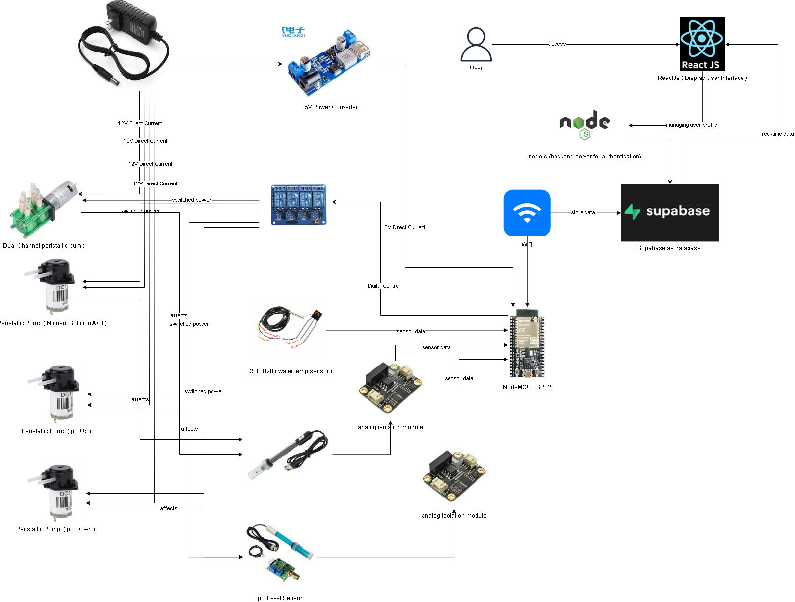
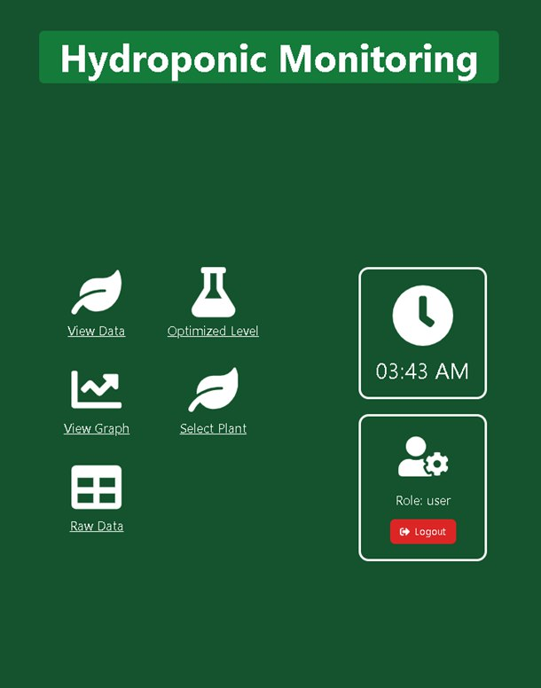
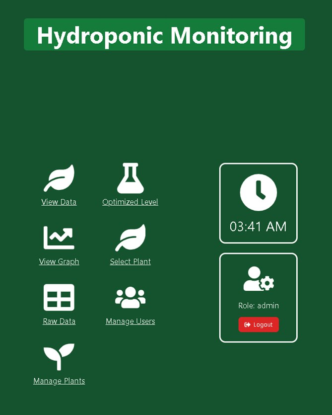
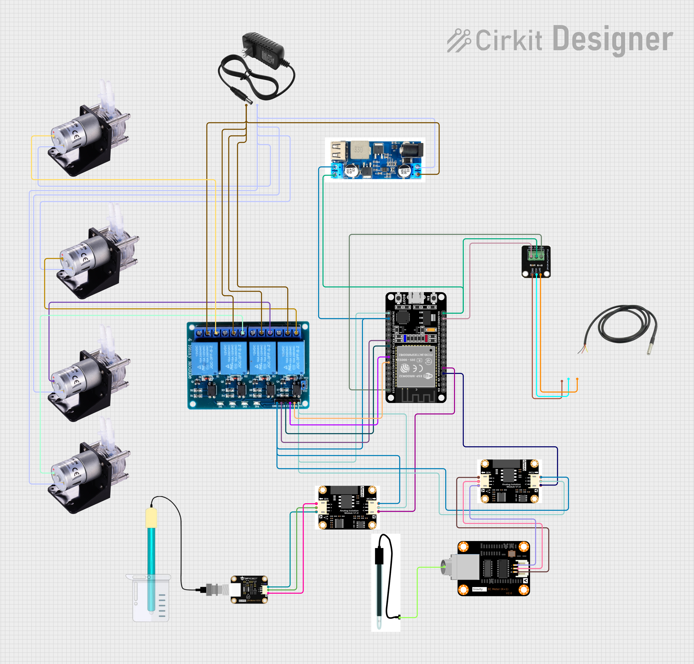

# 🌱 IoT-Enabled Web-Based Automated Hydroponic System

A full-stack IoT system designed for real-time monitoring and automated control of a hydroponic farm using ESP32, Supabase, and a custom-built React dashboard.


---

## 🚀 Features

- **Real-time sensor monitoring** (pH, EC, temperature)
- **Automated pump control** based on crop profiles
- **React dashboard** with ApexCharts for visualization
- **Supabase backend** with Auth and Service Role API access
- **Telegram Bot integration** for instant alerts and commands
- Data logging in central and per-plant Supabase tables
- Calibration support for both pH and EC sensors

---

## 🧠 System Architecture



---

## 📷 Demo


Register Page


Login Page



User Dashboard



Admin Dashboard

---

## 🔧 Hardware Requirements

| Component          | Description                            |
|--------------------|----------------------------------------|
| ESP32 Dev Board     | Wi-Fi enabled MCU                      |
| DS18B20 Sensor     | Water temperature sensor               |
| Analog pH Sensor   | For pH level measurement               |
| Analog EC Sensor   | For electrical conductivity            |
| 4-Channel Relay    | Controls 4 pumps                       |
| Water Pumps        | Nutrient & pH adjustment               |
| Jumper wires, Breadboard, Power source, Tubing, etc.        |

---

## 🛠️ Software Stack

| Layer      | Technology                                 |
|------------|--------------------------------------------|
| Firmware   | Arduino IDE, C++                           |
| Backend    | Supabase (Auth, Realtime DB, REST API)     |
| Frontend   | ReactJS, ApexCharts                        |
| Notification | Telegram Bot API                        |

---

## ⚙️ Setup Instructions

### 1. ESP32 Firmware (Arduino IDE)
- Install libraries: `WiFi.h`, `HTTPClient.h`, `ArduinoJson`, `ESPSupabase`, `DallasTemperature`, `DFRobot_ESP_PH`, `DFRobot_ESP_EC`, `EEPROM`
- Update Wi-Fi and Supabase credentials in the code
- Flash to ESP32

### 2. Supabase Backend
- Create tables:
  - `sensor_data`
  - `plant_profiles`
  - `system_config`
- Enable Row Level Security (RLS) and configure service role access
- Add a `selected_plant_id` field in `system_config` to determine which profile to follow

### 3. React Frontend
- Clone repo and install dependencies
  ```bash
  npm install
  npm start
Connect to Supabase via environment variables

4. Telegram Bot
Use BotFather to create a bot

Link your bot to backend logic to respond to pH/EC commands and send threshold alerts

---

##🤖 Automated Pump Logic

| Condition    | Action          |
| ------------ | --------------- |
| pH < ph\_min | Activate Pump 3 |
| pH > ph\_max | Activate Pump 4 |
| EC < ec\_min | Activate Pump 3 |
| EC > ec\_max | Activate Pump 4 |

Pumps are triggered for 3 seconds and turned off to avoid over-correction.

---

##📁 Folder Structure


---

##📐 Circuit Diagram



---

##📝 License
This project is licensed under the MIT License.
